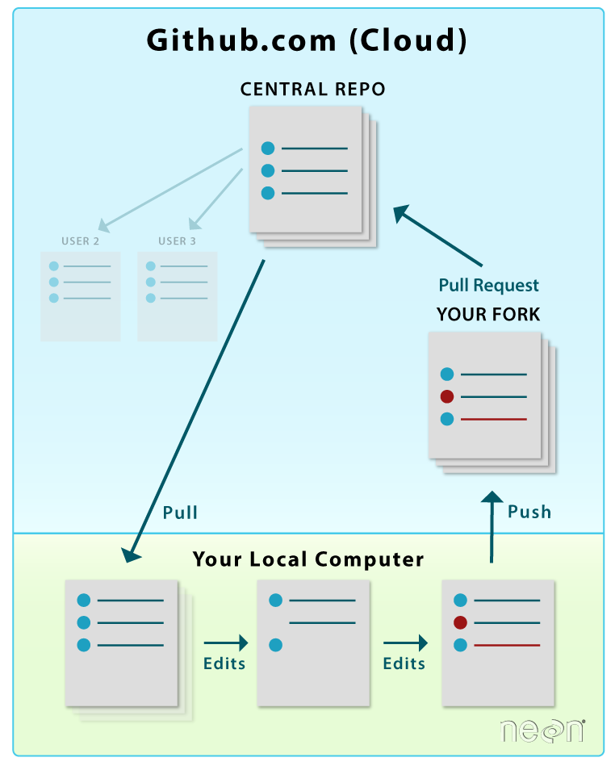

# Mini Guia de GIT

## Por donde empezar

#### usando ssh

#### Instalando git
`sudo apt-get install git`

#### Clonar un repositorio remoto
`git clone https://github.com/YOUR_USERNAME/YOUR_FORK.git`

#### Establecer nombre y email en un repositorio
`git config user.name "Mona Lisa"`

`git config user.email "Monalisa@correo.ugr.es"`

Para consultar los datos:

`git config user.name`

`git config user.email `

#### Especifica un nuevo repositorio ascendente remoto que se sincronizará con la bifurcación.
`git remote add upstream https://github.com/JJ/IV-19-20.git`

#### Consultar repositorios
`git remote -v`

#### Actualizar el repositorio antes de hacer nada (Evitar conflictos)
`git pull upstream master --rebase`

*Actualizará nuestro repositorio local a la última versión de la rama master del repositorio upstream.
De este modo no habrá ningún conflicto cuando modifiquemos nuestros ficheros locales*

#### Consultar el estado del repositorio 
`git status`

#### Comentar y añadir
`git add`

`git commit -m "Comentario"`

##### Combinando Gitt ADD y Git Commit
`git commit -a -m "Actualizados objetivos semana1"`

*Usando este comando lo haríamos todo de una vez*

##### Cerrando un Isue con el commit
`git commit -m "Comentario close #NumIsue "`

#### Interfaz gráfica 
`gitk`

#### Repositorio local -----> Repositorio remoto
`Git push repositorio`

*Actualizará el repositorio que le indiquemos con la copia local, podemos usar TAB para que nos sugiera los repositorios disponibles*

#### Desde mi repositorio en GitHub Remoto crear NEW PULL REQUEST
*Para hacer un PR al repositorio del cual se hizo el fork haremos el PR desde GitHub en nuestro repositorio*

## TAGS

#### Listando etiquetas:
`git tag`

#### Buscando etiquetas:
`git tag -l "v1.*"`

#### Creando etiquetas:
`git tag -a v1.4 -m "my version 1.4"`
	
Añade etiqueta y descripción.

#### Consultar datos de una etiqueta:
`git show v1.4`

#### Push de etiquetas:
`git push origin <tagname>`

#### Eliminar etiquetas:
`$ git tag -d v1.4-lw`

Tambiem podemos usar el atributo `--tags` para que el push afecte a todas.
## Resolución de problemas

### Deshacer el último commit si aun no se ha realizado el *push*
`git reset --hard/--soft HEAD~1`

**--hard:** *Con esta opción estamos indicando que retrocedemos a el comit HEAD ~ 1 y perdemos todas las confirmaciones posteriores. HEAD ~ 1 es un atajo para apuntar al commit anterior al que nos encontramos. CUIDADO, con la opcion –hard, ya que como he dicho se borran todos los commits posteriores al commit al que indicamos.*

**--soft:** *con esta opción estamos indicando que retrocedemos a el commit HEAD ~ 1 y no perdemos los cambios de los commits posteriores. Todos los cambios aparecerán como pendientes para realizar un commit.*

**~ 1** *Especifica el commit al que revertiremos. Tenemos que tener en cuenta que los commit estan en lista y parte de 0.*

**por ejemplo:**
- para deshacer el último utilizaríamos 1 (para saltar el 0)
- para deshacer el penúltimo utilizaríamos 2 (para saltar el 0 y el 1)

### Deshacer el último commit después de realizar el *push*
`git revert HEAD`

*realiza un nuevo commit que borra el commit que queremos eliminar utilizando el comando revert.*

## Esquemas de funcionamiento en git

## Enlaces de interés
[Etiquetas](https://git-scm.com/book/en/v2/Git-Basics-Tagging)

[Rebase](https://stackoverflow.com/questions/18930527/difference-between-git-pull-and-git-pull-rebase)

[Merge & rebase](https://stackoverflow.com/questions/16666089/whats-the-difference-between-git-merge-and-git-rebase/16666418#16666418)

[Fork git y repos remotos1](https://www.neonscience.org/git-setup-remote)

[Fork git y repos remotos2](https://help.github.com/es/github/collaborating-with-issues-and-pull-requests/configuring-a-remote-for-a-fork)

[Guía sencilla GIT](https://rogerdudler.github.io/git-guide/index.es.html)

[Algunos comandos GIT](https://help.github.com/en/github/using-git/setting-your-username-in-git)

[Guía GIT JJ](https://github.com/JJ/IV-19-20/blob/master/objetivos/README.md)

[Usando hooks](https://www.hostinger.es/tutoriales/como-usar-git-hooks/)

[Guía sencilla MARKDOWN](https://markdown.es/sintaxis-markdown/)

**[Volver a INICIO](https://github.com/alexrodriguezlop/IV-Proyect/blob/master/README.md)**
=== 
